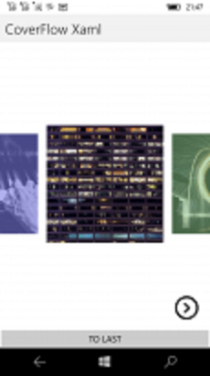

# PanCardView 1

This is my fork of [CardView](https://github.com/AndreiMisiukevich/CardView) project
(Pan)CardView is very cool project that realized CoverFlow, CoverCube and other amazing visual effects! :)

## Screenshots

## My 2 cents

- Original CardView solution explored&refactored (Tizen/GTK/MacOs "targets" deleted)
- UWP "target" fixed a little (XF 2.5 init procedure improved) 
- .NET Standard 1.4 realized (this is for my old sweet Lumia 950);
- 4 main "super effects": Cards, Carousel, CoverFlow, and CubeView recovered;
- Min. supported version of Win10Mobile: 14393;
- Alpha version 1 ready =) 
 

## References

- https://github.com/AndreiMisiukevich/CardView/ Original CardView solution
- https://github.com/AndreiMisiukevich/ CardView's author, Great C# Developer 

## .
AS IS. No support. RnD only.

## ..
- [m][e] 2022

